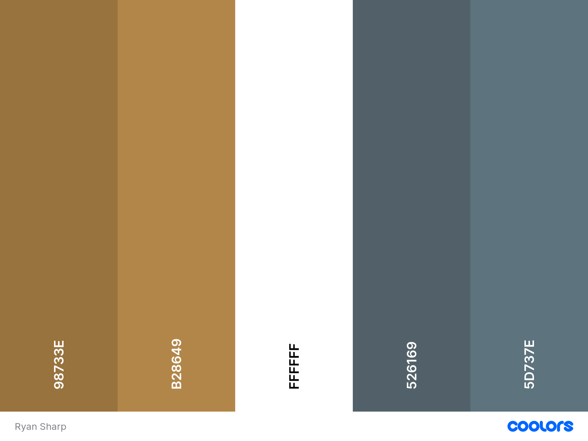

# Food Twisters 

[Link to deployed site](https://food-twisters.herokuapp.com/)

# **Table Of Contents**
* [**Food-Twisters**](#food-twisters)
* [**Introduction**](#introduction)
* [**UX**](#UX)
  * [**User Stories**](#user-stories)
     * [**Users**](#users)
     * [**Admin**](#admin)
  * [**Development Planes**](#development-planes)
  * [**Strategy**](#strategy)
     * [**Site Aims**](#site-aims)
  * [**Oppourtunities**](#oppourtunities)
     * [**Scope**](#scope)
  * [**Structure**](#structure)
     * [**Database Schema**](#database-schema)
     * [**Skeleton**](#skeleton)
  * [**Design**](#design)
     * [**Colour Scheme**](#colour-scheme)
     * [**Logo**](#logo)
     * [**Typography**](#typography)
     * [**Imagery**](#imagery)
* [**Features**](#features)
     * [**Design Features**](#design-features)
     * [**Existing Features**](#exisiting-features)
     * [**Features to implement in the future**](#features-to-implement-in-the-future)
* [**Issues and Bugs**](#issues-and-bugs)
* [**Technologies Used**](#technologies-used)
     * [**Main Languages**](#main-languages-used)
     * [**Additional Languages**](#additional-languages-used)
     * [**Frameworks, Libraries and Programes**](#frameworks-libraries--programs-used)
* [**Testing**](#testing)
    * [**User Stories**](#user-stories-1)
    * [**Manual Testing**](#manual-testing)
        * [**Common Elements Testing**](#common-elements-testing)
        * [**Page Testing**](#page-testing)
    * [**Automated Testing**](#automated-testing)
        * [**Code Validation**](#code-validation)
        * [**User Testing**](#user-testing)
        * [**Broswer Validation**](#browser-validation)
* [**Deployment**](#deploymemt)
    * [**Deploying to Heroku**](#deploying-on-heroku)
* [**Credits**](#credits)
    * [**Content**](#content)
    * [**Media**](#media)
    * [**Code**](#code)
    * [**Acknowledgements**](#acknowledgements)

 
# **Introduction**

This project is my 4th project of the 5 project course for Code Institute. 

This was the first idea that I came up with when getting to planning the project. However, due to the complexity of the original plan, I had to scale back my plans for the project in order to be able to deliver the project on time. I followed the Django Blog tutorial from my Code Institute course, tweaking it to my needs. I found once going over the tutorial again I grew confident with the idea of how it all worked I started to branch out into other ideas for my project.

The main requirement of this project was to build a Full Stack site based on business logic used to control a centrally-owned dataset. This required me as the the developer to set up an authentication mechanism and provide role-based access to the site's data.

This site is a community platform in the form of a blog post where users can interact with other users recipes. In addition to this, the user can document their own recipes and upload them. Users can create an account of Food Twisters which opens up more oppourtunities on the app rather than just browsing through the recipes with no real interaction.

# **UX**
## **User Stories**
### **Users**
1. As a Site User I can look through a paginated list of recipes so that I can select a recipe that looks good to make.
2. As a site user/admin I can see the date a post was made so that I can keep up with the latest cooking trends.
3. As a Site user I can click and load up other users' recipes so that expand my cooking knowledge.
4. As a site user I can change my password so that I can ensure the protection of my account. (Wasn't implemented in the final release as I ran out of time for the project. I do intend to add it in the future after grading is complete).
5. As a site user I can upload a recipe so that I can share my ideas with other users.
6. As a Site user I can upload images with my recipes so that other users can see what the recipe will make.
7. As a Site User/Admin I can see the number of likes and comments so that I can keep up with the conversation.
8. As a Site User I can keep my account login information hidden so that my account will be restricted to just me.
9. As a Site User I can sign in and out of my account so that I can protect my account when I am not using it. 
10. As a Site User I can create and maintain an account so that I can create my own post and interact with others.
11. As a Site user I can comment on posts so that I can interact with the content.
12. As a Site user I can see my login status so that I know if I am logged in or not.
13. As a Site User I can like and unlike posts/comments so that I can interact with the content.
14. As a Site User / Admin I can create, read, update and delete posts so that I can manage my blog content.
15. As a Site User I can create drafts of potential posts so that change and post them at a later date. (Wasn't implemented in the final release as I ran out of time for the project. I do intend to add it in the future after grading is complete).

### **Admin**
1. As an Admin I can filter, search and delete posts so that I can manage my website content.
2. As an Admin I can control what comments stay on posts so that I can filter out objectionable comments.

## **Development Planes**

To create a comprehensive and appealing website, I researched other food based websites. This not only helped me with deciding on features and functionalities which work with my project, but helped me to decide on a colour scheme for the project too.

### **Strategy**

#### **Site Aims**

My main aim for the website was to create a website that users could use with ease and interactive with not only their own recipes which they could upload, but interact with other users as well. I wanted to create a community where people could go to upload new recipes and be able to try out new recipes. 

A user may also use this website for their own personal storage box for recipes. They are able to store all their recipes on here and they can access just those recipes when they need to.

The website focuses on the following target audiences:
- **Roles:**
    - User
    - Admin

- **Demographic:**
    - Food loving people
    - People looking for more recipes to expand their food knowledge
    - Cooking enthusiasts

The website needs to enable the user to:
- Browse recipes
- Create and set up their own account
- Create and upload their own recipes
- Like and comment on recipe

The website needs to enable the admin to:
- Approve recipe uploads and comments
- Filter through recipes, comments, users to ease control of the site

### **Oppourtunities**

With the user storied in mind, I created a table to help narrow down and priotize the scope of the intended strategy.

#### **Scope**

A scope was defined to indetify what needed to be done to align features with the strategy previously defined. Due to the imbalance of scores above, there will be some trade-offs. The was broken into these categories:

- **Content Requirements**
    
    - The UX *must* address these:
        - A comprehensive list of recipes.
        - A comprehensive set of instructions with ingredients to follow.
        - A list of all comments made on a recipe.
    - The UX *should* accommodate these:
        - Easy navigation of the site.
        - Ability to comment and like recipes.

### **Structure**

 I created a flow chart to help me create navigation throughout the website and keeps tabs on what users were able to do while either logged in or not. 

 

 #### **Database Schema**

 Here is the database schema for my initial plan for my database tables:

 

 As you can see in the image my initial idea ended up being more simple than the final outcome. It was only after initially creating the database that I decided to inculde more fields in the recipe database. These new fields would become;
- FK category(Category)
- preparation_time(Charfield)
- cooking_time(CharField)
- total_time(CharField)

About half way through the project I decided that I wanted the User to be able to view all recipes created either altogether or in certain categories. That is why I decided to create a Category model which isn't present in the initial database schema. 

#### **Skeleton**

All wireframe mockups were created using Balsamiq.

### **Design**

#### **Colour Scheme**

After doing research on what other food based websites there where I came to the conclusion the best colour scheme would be simple. a lot of other websites go very simplistic with their colour scheme so I decided to do the same. I stuck with a plain white background because I didn't want to take too much focus off from the features of the website. I also used a lot of different shades of browns and dark-greys. 

I typically used the lighter browns and greys for the primary colours on the web page. I tried to keep it as cosistent as possible throughtout the entire website. the darker shades of both colours were typically used for hover effects so it was clear to the user that they could interact with what they were hovering over.

#### **Logo**

I wanted the logo to be the main focus of the entire website. So because of that reason I styled it differently to mostly every other text on the page. The logo, which is situated on the Nav Bar is a different colour, font and size to the rest of the navigation bar. The logo also acts as a link to take the user back to the home page.

#### **Typography**

There are a lot of different fonts that were used throughout the project. Depsite the fact that a lot were used, there were similarities within most of them. Like previously stated, I wanted the logo to be the centerpiece so I picked 'Inspiration' which gave it the flare it needed.

I wanted the user to have a clear understanding of the different sections of the website and I achieved that by separating the sections up with different fonts. 

The font for the body which is used prodominetaly throughout the site is Hubballi.

Here is the full list of all the fonts used:
- Grape Nuts 
- Hubballi 
- Inspiration 
- Kavoon 
- Orelega One 
- Roboto Condensed
- Square Peg

All fonts where selected from Google Fonts.

#### **Imagery**

To match my colour scheme of brown, white and grey, I largely chose all of my images based on them. The hero image of the index page. 

Also on the index page there are two anchor tags with the text 'make a recipe' and 'see recipes'. Behind each of them are images. the image used for the 'make a recipe' Is a bunch of eggs and flour which represents the making of a product (A recipe). Behind the 'see recipes' is an image of different produces (mainly bread). This represents a finished product, which is like the user clicking to see the finished recipe. 

For the logout and signup pages I chose images to represent what the page is. For instance the signup image is a welcome sign, as if welcoming the new user to the website. The logout image features a closed sign signalling a goodbye to the user. 

[Back to top ⇧](#food-twisters)

# **Features** 

## **Design Features**

Each page of the website features a consistent responsive navigational system:

- The header contains the logo of the website in the center of the navigation bar. This will also redirect users back to the home page once clicking on it. On smaller screens, everything but the logo is condensed down into a dropdown menu which provides users with the same navigation. I chose a dropdown because I think it works better and is more presentable on smaller devices. On the far right of the navigation bar the user is presented with either 'login' or 'logout' depending on if the have an account they are logged into.

- The footer is intentionally simple to keep up with the simplicity of the rest of the site. It contains social network links with text above it which reads 'want to find out more?' with a copyright next to it.

## **Exisiting Features**

- Navigation bar which is featured on every page throughout the site to allow users easy access should they want to go to a different page.
- Social icons which appear on the footer of every page.
- Recipe cards which appear on the recipes page, the recipe cards only give out the title of the recipe and the user who uploaded it, this is to not make it overcomplicated and to the user.
- Recipe form on the create page which is only available to users that are registered and logged in. Unregistered users are able to go onto the create page but they will just be shown a message prompting them to signup or log in.
- Personal recipes created only by the user logged in will be found in my recipes which can be located by clicking 'click here' on the recipes page. The users will be taken to a separate page where recipe cards of their own recipes are shown.
- Comment form which appears on the recipe detail page which is accessible by clicking on a recipe that they want. the comment form however only shows up for registered users. Unregistered users can see comments left by other users though. Once a user has submitted a comment the page will reload and when they scroll down an alert message where the comment form once was saying the comment has been published and underneath the comment will appear. 
- There is a like button situated next to the information of who the author of the recipe is and when it was uploaded on in recipe detail. It is in the shape of the heart and beside it is a number which shows the number of likes that specific recipe has. If the user has liked the recipe but changed their mind, all they would need to do is click on the heart again to unlike it. 
- The home page is really just a welcoming page for the user. They are greeted personally with the first header on the page which will include the username that they signed up with. The home page does feature some functionality to the website though. It has links which will direct users to either the create page or the recipe page. Below both of them is a contact box the users can find out information including an contact number, email address and an address.
- The recipe page is a few functions. First off the user can see a plus button right next to the Title. If clicked the user will be directed to the create page. Beneath that there will be one of two sentences. If the user is logged in then they will have a click here button which will take them to a page of just there recipes. If they aren't they will have a message promtping them to log in so they can see their own recipes. Below all that there will be recipe cards of all recipes that all users on the site have made. registered and unregistered users have full access to them.
- The edit/delete buttons are only available to the users that are logged in and are the creator of the recipe. The buttons are found underneath the recipe information on the recipe detail page.
- Sign in page which is designed to allow a user to log in if already registered. If they are not then there is a link to take them to the signup page.
- Sign out page is designed to allow users to log out of their account. If the user does sign out then they will be redirected to the home page.
- Sign up page is designed to allow new useres to create an account which will give them more access to the site. They will create their profile with a username, password that needs to be repeated to ensure is correct and an optional email address if the user would like to. 

## **Features to Implement in the future**

- A personal profile page for all users where all their recipes, favourites, drafts are shown on one page.
- The ability for a user to favourite/save a recipe they like and want to use in the future which they can access through its own page.
- For each recipe to have the option to showcase nutritional values and publicily show them if they know and want to share them.
- The ability to for a user to create a draft and save it on their own profile so they can go back to at a later date.
- To allow a user to delete their own comments if they so wish to. (Wasn't implemented in release as I ran out of time with the project)
- To allow images to be uploaded with a users comment.
- The addition of a search bar either on the navigation bar or on the recipes page so users can limit the amount of recipes they have to scroll through to find one that they had in mind. (Wasn't in the inital release due to lack of time. I do intend to implement this in the project after the grading is completed)
- The ability to add other users as friends and private messages so they can send recipes if they didn't want to do it publicly.

[Back to top ⇧](#food-twisters)

## **Issues and Bugs**

*Bug* - I had a few problems with summernote not working on the actual website despite it working perfectly on the admin page. At first it wasn't even loading on the website so I had to find a solution:
- My first issue with summernote was it not loading onto the website. The *solution* for this was to add '| safe' after loading it in.
- My second issue that I faced was on smaller screens sizes the summernote wouldn't fit on the screen like the rest of the form did. The solution for this was to add in summernote_config into setting.py and from there I was able to change the width, height and what I actually wanted on the summernote that users could access.

*Bug* I faced an issue when deploying my project to heroku with my CSS not loading in:
- The solution for this was to turn debug = True to False.

*Bug* When creating a template, view and url path for category.html I kept facing an issue where it would throw an error when trying to load the sight. I looked on slack to see if I could find anyone with the same issue and I did but for some reason their solutions wasn't working for me:
- The solution for this bug was I contacted tutor support and we found out that I need to do a data refresh on my browser. It was more than just a hard refrsh of the site, I had to go into my google seetings and reset the data for it. After that it worked.

*Issue* I found on issue with the urls in settings.py which threw an error when validating due to the character line being too long but there is no way to reduce.

[Back to top ⇧](#food-twisters)

## **Technologies Used**

### Main Languages Used
- [HTML5](https://en.wikipedia.org/wiki/HTML5 "Link to HTML Wiki")
- [CSS3](https://en.wikipedia.org/wiki/Cascading_Style_Sheets "Link to CSS Wiki")

### Additional Languages Used
- [Python](https://en.wikipedia.org/wiki/Python_(programming_language) "Link to Python Wiki")
     - Used to implement Django functionality, including building models, forms and views for the app.

### Frameworks, Libraries & Programs Used
- [Django](https://www.djangoproject.com/ "Link to Django Project website")
    - Django was used to build the models, forms and views of the app, and was the backbone of this project.
- [Bootstrap](https://getbootstrap.com/docs/5.0/getting-started/introduction/ "Link to Bootstrap page")
     - Bootstrap was used to implement the responsiveness of the site, using bootstrap classes.
- [Cloudinary](https://cloudinary.com/ "Link to Cloudinary page")
     - Cloudinary was used as free cloud storage for images uploaded to the site through the recipe forms.
- [Summernote](https://summernote.org "Link to Summernote page")
     - Summernote was used to allow users to add styling when adding a recipe to the site. This is particularly useful for using bullet points for ingredients or numbering the steps for the recipe.
- [Crispy Forms](https://django-crispy-forms.readthedocs.io/en/latest/ "Link to the Crispy Forms documentation")
    - Crispy Forms was used to style the add and edit recipe forms, allowing more than one field to occupy a line on the form.
- [Google Fonts](https://fonts.google.com/ "Link to Google Fonts")
    - Google fonts were used to import the fonts "Poppins" and "Dancing Script" into the style.css file. These fonts were used throughout the project.
- [Font Awesome](https://fontawesome.com/ "Link to FontAwesome")
     - Font Awesome was used on all pages throughout the website to import icons (e.g. social media icons) for UX purposes.
- [Git](https://git-scm.com/ "Link to Git homepage")
     - Git was used for version control by utilizing the GitPod terminal to commit to Git and push to GitHub.
- [GitHub](https://github.com/ "Link to GitHub")
     - GitHub was used to store the project after pushing
- [Am I Responsive?](http://ami.responsivedesign.is/# "Link to Am I Responsive Homepage")
     - Am I Responsive was used to see responsive design throughout the process and to generate mockup imagery to be used.

[Back to top ⇧](#food-twisters)

## **Testing**

### **User Stories**
1. As a Site User I can look through a paginated list of recipes so that I can select a recipe that looks good to make.
    - If the amount of recipes of recipe page exceed the number of six then the remainder, starting with the oldest post, will be moved onto the next page. This will continue until there are six or less recipe cards on the front page.
2. As a site user/admin I can see the date a post was made so that I can keep up with the latest cooking trends.
    - On recipe detail page below the image of the recipe, it shows the user when the post was uploaded and who it was uploaded by.
3. As a Site user I can click and load up other users' recipes so that expand my cooking knowledge.
    - On each recipe card on the recipe page it tells the user the name of the recipe and who uploaded it. If the user clicks on the title then they will be directed to recipe detail page where they will get all the information about that recipe.
4. As a site user I can upload a recipe so that I can share my ideas with other users. 
    - There is a separate page on the website that users can click on to which they will then have to fill out a form and submit it before it gets published.
5. As a Site user I can upload images with my recipes so that other users can see what the recipe will make.
    -  Once a recipe has been uploaded by a user the image they selected will be the face of the recipe card and on the recipe detail page. If they don't choose an image with their recipe then a placeholder is provided.
6. As a Site User/Admin I can see the number of likes and comments so that I can keep up with the conversation.
    - Next to the like button there is a number which indicates how many likes the recipe has gotten. (Should be noted that there is no number count for the amount of comments on the recipe. I ran out of time for the project before I could implement it)
7. As a Site User I can keep my account login information hidden so that my account will be restricted to just me.
    - When creating an account and filling out the password, the password is protected by asteriks. Users can also log out to prevent anyone using their account.
8. As a Site User I can sign in and out of my account so that I can protect my account when I am not using it. 
    - there are separate pages for logging in and out on.
9. As a Site User I can create and maintain an account so that I can create my own post and interact with others.
    - The user is able to create an account and manage all of their own posts on the user recipe page which can be accessed through the recipe page.
10. As a Site user I can comment on posts so that I can interact with the content.
    - Underneath the image and recipe info on recipe detail is a comment section which showcases all comments made on the recipe and a comment form which can only be accessed by registered users.
11. As a Site user I can see my login status so that I know if I am logged in or not.
    - The user will know if they are logged in because of the navigation bar it will tell them to logout rather than login. When logged in users use the home page the main title on the page greets them with the username that they selected when ccreating the account.
12. As a Site User I can like and unlike posts/comments so that I can interact with the content.
    - A user that is registered and logged in has the ability to like and unlike a recipe on the recipe detail page.
13. As a Site User / Admin I can create, read, update and delete posts so that I can manage my blog content.
    - Both admin and user can create, read and update posts on the site.

### **Manual Testing**

#### **Common Elements Testing**

- Navigation works on every page.
- All social links in the footer open a new page following the correct link.

#### **Page Testing**

- Once logged in, the navigation login changes to logout.
- Links to Create recipe and Recipe page on the home page work/
- All recipe cards have clickable links which direct the r=users to the recipe detail page featuring all the information they need. 
- the plus button on the recipe page will send users to the create recipe page and works how it is supposed to.
- The 'click here' link on the recipe page that is available to logged in users works and take them to user-recipe page which shows only their ecipes.
- The edit and delete buttons that are available to a user if they are logged in and are the one who created the recipe all work and will direct them to the correct page.
- The comment form and submit button work and once submitted an alert pops up where the comment form was to tell users their comment has been published.
- The login, logout and signup pages work with no issues.
- The categories when clicked will direct users to the correct page.
- All pages are responsive and are styled for large medium and small screens.

### **Automated Testing**

#### **Code Validation**

The [W3C Markup Validator](https://validator.w3.org/ "Link to M£C Markup Validator Site") service was used to validate the `HTML` and `CSS` code used. The [PEP8 Python Validator](http://pep8online.com/ "Link to the PEP8 Python Validator Site") was used to validate the `Python` code used.

- HTML pages - Code Validation - all HTML pages clear.

- CSS Stylesheet - CSS tested with no errors.

Python files tested where:
- recipes - admin.py
- recipes - apps.py
- recipes - forms.py
- recipes - models.py
- recipes - urls.py
- recipes - views.py
- food_twisters - settings.py
- food_twisters - urls.py

All those files tested clear.

#### **User Testing** 

I asked the people on slack to test my project multiple times and each time I listened to any problems that arised and adjusted them.

I also asked many family and friends to test it too on different devices and different browsers and again adjusted anything that wasn't giving them the best experience.

#### **Browser Validation**

I tested my project on both chrome and safari.

[Back to top ⇧](#food-twisters)

## **Deploymemt**

This project was developed using a [GitPod](https://gitpod.io/ "Link to GitPod") workspace. The code was commited to [Git](https://git-scm.com/ "Link to Git") and pushed to [GitHub](https://github.com/ "Link to GitHub") using the terminal.

### Deploying on Heroku
To deploy this page to Heroku from its GitHub repository, the following steps were taken:

1. Create the Heroku App:
    - Select "Create new app" in Heroku.
    - Choose a name for your app and select the location.

2. Attach the Postgres database:
    - In the Resources tab, under add-ons, type in Postgres and select the Heroku Postgres option.

3. Prepare the environment and settings.py file:
    - In the Settings tab, click on Reveal Config Vars and copy the url next to DATABASE_URL.
    - In your GitPod workspace, create an env.py file in the main directory. 
    - Add the DATABASE_URL value and your chosen SECRET_KEY value to the env.py file.
    - Add the SECRET_KEY value to the Config Vars in Heroku.
    - Update the settings.py file to import the env file and add the SECRETKEY and DATABASE_URL file paths.
    - Update the Config Vars with the Cloudinary url, adding into the settings.py file also.
    - In settings.py add the following sections:
        - Cloudinary to the INSTALLED_APPS list
        - STATICFILE_STORAGE
        - STATICFILES_DIRS
        - STATIC_ROOT
        - MEDIA_URL
        - DEFAULT_FILE_STORAGE
        - TEMPLATES_DIR
        - Update DIRS in TEMPLATES with TEMPLATES_DIR
        - Update ALLOWED_HOSTS with ['app_name.heroku.com', 'localhost']

4. Store Static and Media files in Cloudinary and Deploy to Heroku:
    - Create three directories in the main directory; media, storage and templates.
    - Create a file named "Procfile" in the main directory and add the following:
        - web: gunicorn project-name.wsgi
    - Log in to Heroku using the terminal heroku login -i.
    - Then run the following command: **heroku git:remote -a your_app_name_here** and replace your_app_name_here with the name of your Heroku app. This will link the app to your Gitpod terminal.
    - After linking your app to your workspace, you can then deploy new versions of the app by running the command **git push heroku main** and your app will be deployed to Heroku.
    
## **Credits**

### **Content**
- Most recipes were created for my site were taken from [BBC GoodFood](https://www.bbcgoodfood.com/ "Link BBC GoodFood website")'.

### **Media** 
- Most images that were used on the site were taken from [Pexels](https://www.pexels.com/royalty-free-images/)

### **Code**
References used:
- [Stack Overflow](https://stackoverflow.com/ "Link to Stack Overflow page")
- [Bootstrap](https://getbootstrap.com/ "Link to BootStrap page")
- [Summernote GitHub Docs](https://github.com/summernote/summernote, "Link to Summernote's GitHub page")

## **Acknowledgements** 

- I would like to thank everyone in the slack community for their incredible support over the last couple of months with my and my project. I would personally like to thank JoGorska, DavidHorrocks and ShellieDownie for their incredible support and each taking time out of their day to help me.
- Everyone over at tutor support for helping me get through some of the toughest problems I have faced in the project. 

[Back to top ⇧](#food-twisters)