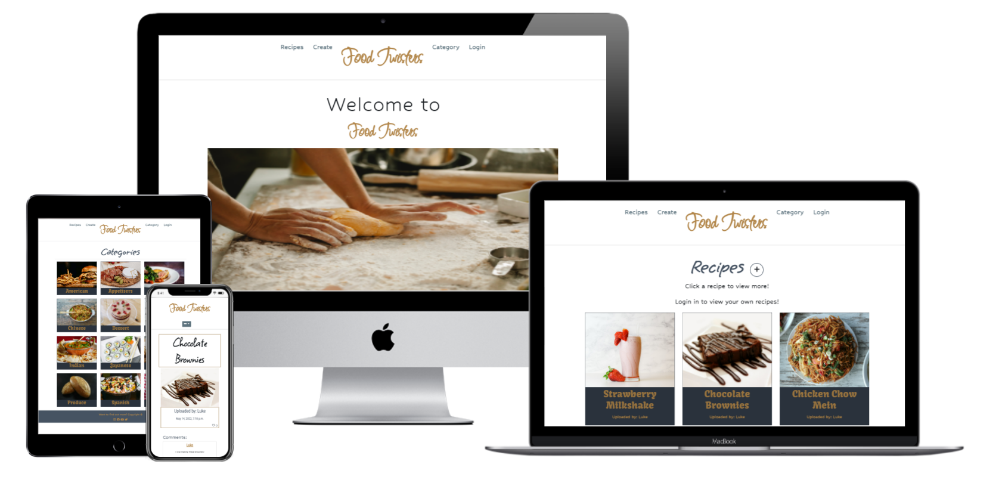
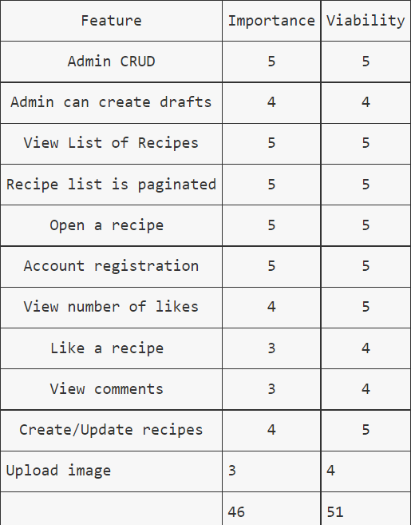
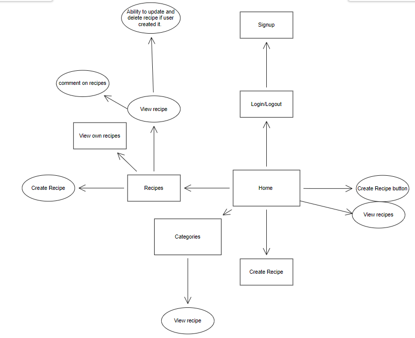
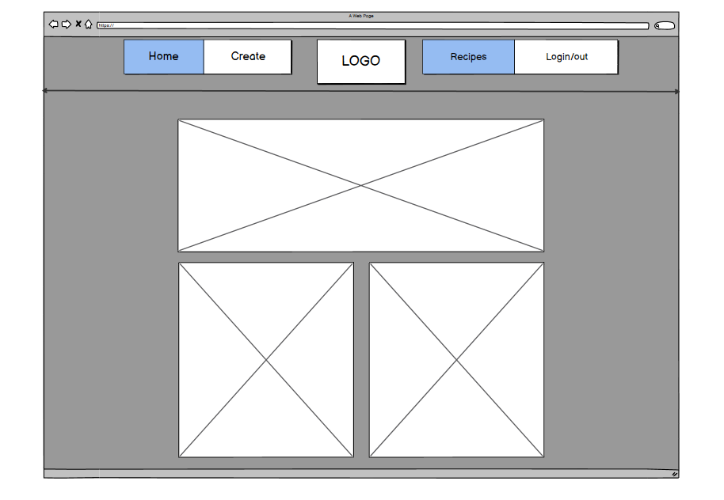
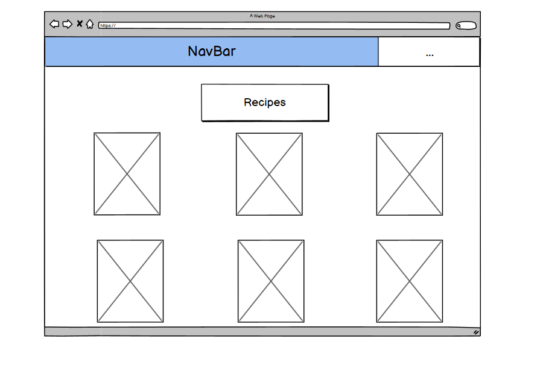
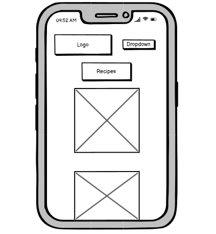

# Food Twisters 

[Link to deployed site](https://food-twisters.herokuapp.com/)

# **Table Of Contents**
* [**Food-Twisters**](#food-twisters)
* [**Introduction**](#introduction)
* [**UX**](#UX)
  * [**User Stories**](#user-stories)
     * [**Users**](#users)
     * [**Admin**](#admin)
  * [**Development Planes**](#development-planes)
  * [**Strategy**](#strategy)
     * [**Site Aims**](#site-aims)
  * [**Oppourtunities**](#oppourtunities)
     * [**Scope**](#scope)
  * [**Structure**](#structure)
 
# **Introduction**

This project is my 4th project of the 5 project course for Code Institute. 

This was the first idea that I came up with when getting to planning the project. However, due to the complexity of the original plan, I had to scale back my plans for the project in order to be able to deliver the project on time. I followed the Django Blog tutorial from my Code Institute course, tweaking it to my needs. I found once going over the tutorial again I grew confident with the idea of how it all worked I started to branch out into other ideas for my project.

The main requirement of this project was to build a Full Stack site based on business logic used to control a centrally-owned dataset. This required me as the the developer to set up an authentication mechanism and provide role-based access to the site's data.

This site is a community platform in the form of a blog post where users can interact with other users recipes. In addition to this, the user can document their own recipes and upload them. Users can create an account of Food Twisters which opens up more oppourtunities on the app rather than just browsing through the recipes with no real interaction.

# **UX**
## **User Stories**
### **Users**
1. As a Site User I can look through a paginated list of recipes so that I can select a recipe that looks good to make.
2. As a site user/admin I can see the date a post was made so that I can keep up with the latest cooking trends.
3. As a Site user I can click and load up other users' recipes so that expand my cooking knowledge.
4. As a site user I can change my password so that I can ensure the protection of my account.
5. As a site user I can upload a recipe so that I can share my ideas with other users.
6. As a Site user I can upload images with my recipes so that other users can see what the recipe will make.
7. As a Site User/Admin I can see the number of likes and comments so that I can keep up with the conversation.
8. As a Site User I can keep my account login information hidden so that my account will be restricted to just me.
9. As a Site User I can sign in and out of my account so that I can protect my account when I am not using it. 
10. As a Site User I can create and maintain an account so that I can create my own post and interact with others.
11. As a Site user I can comment on posts so that I can interact with the content.
12. As a Site user I can see my login status so that I know if I am logged in or not.
13. As a Site User I can like and unlike posts/comments so that I can interact with the content.
14. As a Site User / Admin I can create, read, update and delete posts so that I can manage my blog content.
15. As a Site User I can create drafts of potential posts so that change and post them at a later date.

### **Admin**
1. As an Admin I can filter, search and delete posts so that I can manage my website content.
2. As an Admin I can control what comments stay on posts so that I can filter out objectionable comments.

## **Development Planes**

To create a comprehensive and appealing website, I researched other food based websites. This not only helped me with deciding on features and functionalities which work with my project, but helped me to decide on a colour scheme for the project too.

### **Strategy**

#### **Site Aims**

My main aim for the website was to create a website that users could use with ease and interactive with not only their own recipes which they could upload, but interact with other users as well. I wanted to create a community where people could go to upload new recipes and be able to try out new recipes. 

A user may also use this website for their own personal storage box for recipes. They are able to store all their recipes on here and they can access just those recipes when they need to.

The website focuses on the following target audiences:
- **Roles:**
    - User
    - Admin

- **Demographic:**
    - Food loving people
    - People looking for more recipes to expand their food knowledge
    - Cooking enthusiasts

The website needs to enable the user to:
- Browse recipes
- Create and set up their own account
- Create and upload their own recipes
- Like and comment on recipe

The website needs to enable the admin to:
- Approve recipe uploads and comments
- Filter through recipes, comments, users to ease control of the site

### **Oppourtunities**

With the user storied in mind, I created a table to help narrow down and priotize the scope of the intended strategy.

#### **Scope**

A scope was defined to indetify what needed to be done to align features with the strategy previously defined. Due to the imbalance of scores above, there will be some trade-offs. The was broken into these categories:

- **Content Requirements**
    
    - The UX *must* address these:
        - A comprehensive list of recipes.
        - A comprehensive set of instructions with ingredients to follow.
        - A list of all comments made on a recipe.
    - The UX *should* accommodate these:
        - Easy navigation of the site.
        - Ability to comment and like recipes.

### **Structure**

 I created a flow chart to help me create navigation throughout the website and keeps tabs on what users were able to do while either logged in or not. 

 

 #### **Database Schema**

 Here is the database schema for my initial plan for my database tables:

 

 As you can see in the image my initial idea ended up being more simple than the final outcome. It was only after initially creating the database that I decided to inculde more fields in the recipe database. These new fields would become;
- FK category(Category)
- preparation_time(Charfield)
- cooking_time(CharField)
- total_time(CharField)

About half way through the project I decided that I wanted the User to be able to view all recipes created either altogether or in certain categories. That is why I decided to create a Category model which isn't present in the initial database schema. 

#### **Skeleton**

All wireframe mockups were created using Balsamiq.

